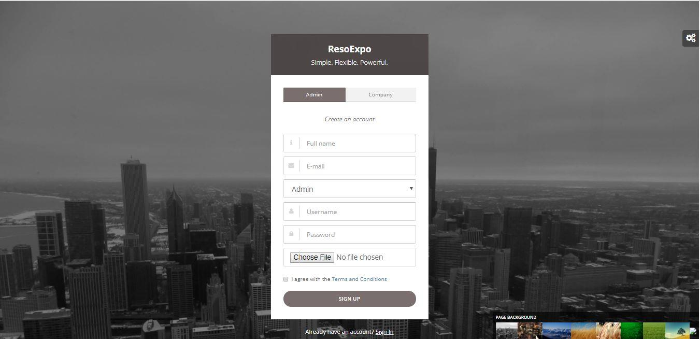
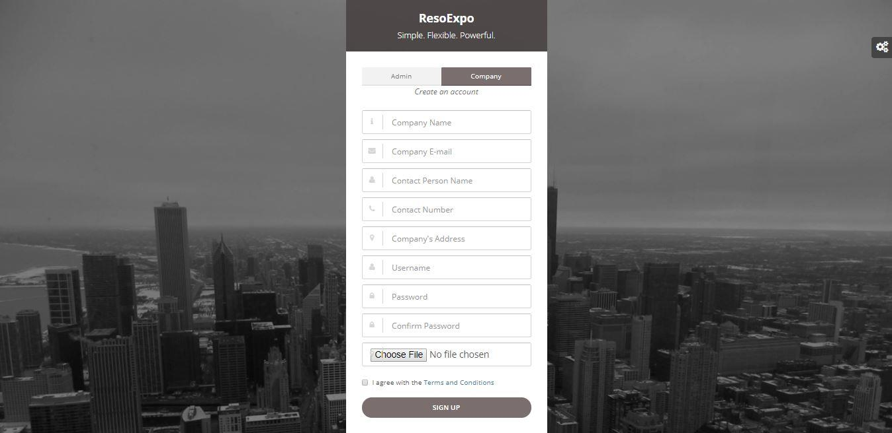
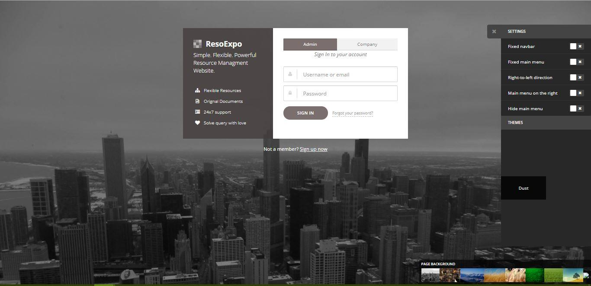
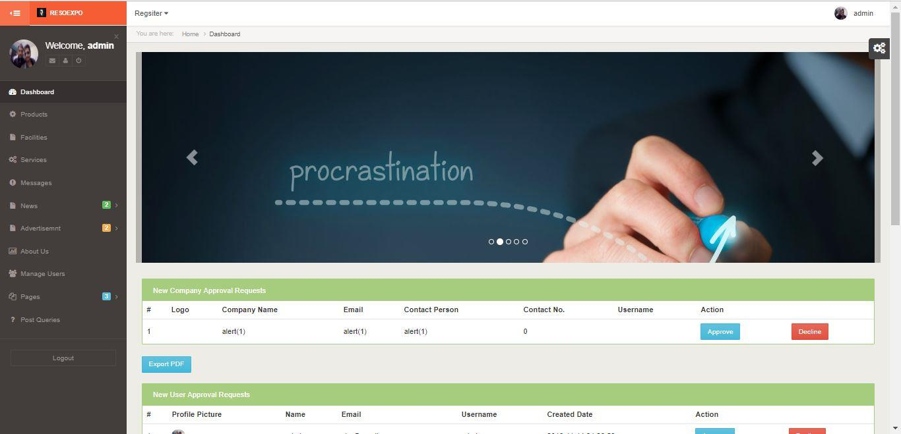
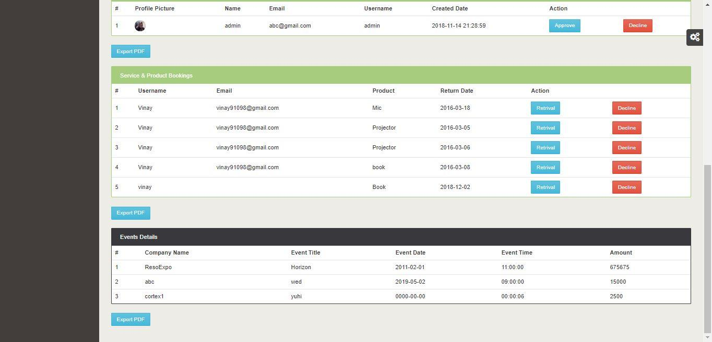
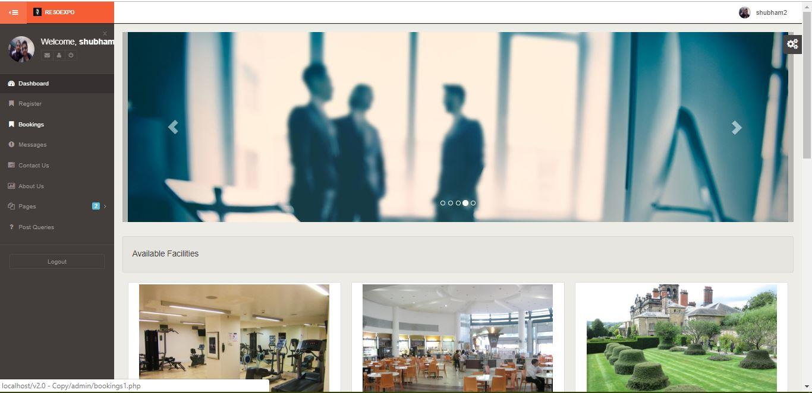
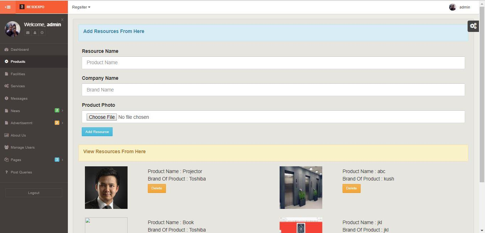
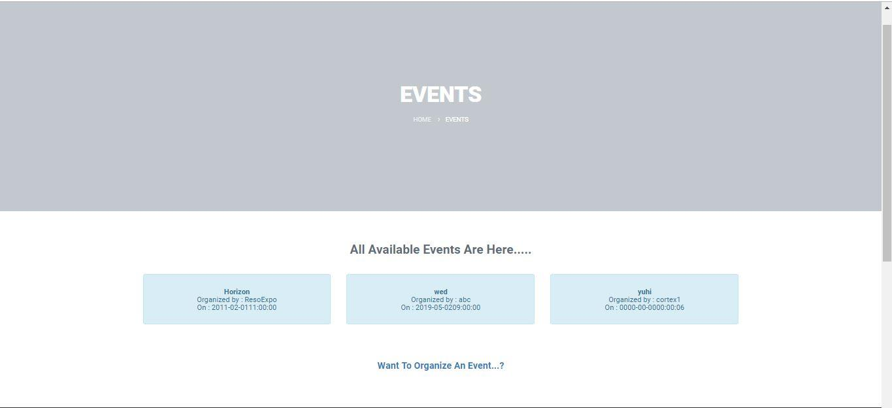
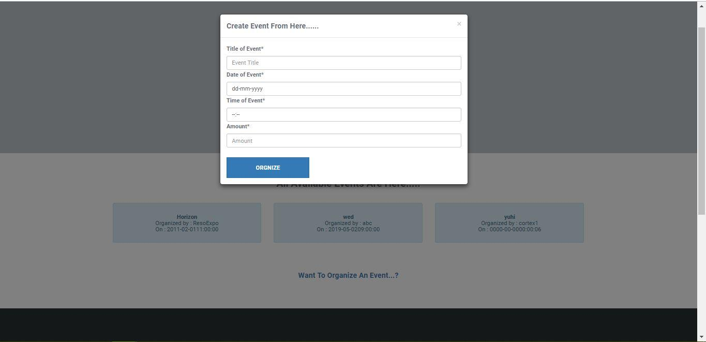

# Resoexpo
### :page_facing_up: Description
+ ResoExpo is a resource management website meant for helping people organize their personal and professional events in an easy and convenient manner.It provides users whether it is an individual or company to organize events or ask for the available resources like halls,plots,banquets,catering services and etc. which they need.

+ The company/Merchant is approved only by the adminstrator of the website from the admin panel. It provides users with a secure experience, this site follows the security triad CIA i.e confidentiality, integrity and availability as much as possible but we all know security is never perfect.

+ To improve our security ResoExpo has a separate portal for its company/merchants and users which helps in changing each and every aspect of website from its gallery to its news feed, faqs, message response and many more with online payment support.

+ In simple words, It is a Website that handles the bookings of the various services and facilities by the registered members and all bookings are managed by the Administrator at backend.

### :book: Project Report
To get more insights about the website please read the detailed capstone report. [Capstone Report](./CAPSTONE.pdf)

### :camera: Screenshots

 Figure 1 : Signup Page for Admin.

    

 Figure 2 : Signup Page for Company/Merchant.

    

 Figure 3 : Login Page with Customized Setting Widget.

    

 Figure 4 & 5 : Admin Dashboard with multiple features at the backend.

    
    

 Figure 6 : Company Dashboard.

    

 Figure 7 : Adding resources from the Admin Panel

    

 Figure 8 & 9 : Displaying all upcoming events to the user and booking a slot for them.

    
    

